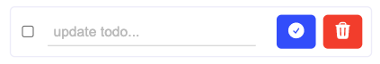

# TODO APP

Welcome to the CRUD Todo app. With this todo app, you can create, read, update and delete todos. 

Furthermore, the todos are stored in local storage, so don't worry about leaving the page - your todos will be waiting for you as you left them.


Add some todos and you'll notice they are sorted with the most recent todo being displayed at the top of the todo list. 


You can see by comparing this image to the image above.


As mentioned, this is a CRUD application. So far you've seen how we create and read the todos. Let's look into how we can edit our todos.

Simply press the edit icon button.



Now you will have the option to edit the todo. Simply press enter of the confirm icon button to complete the edit.


Congratulations, your todo has now been cussessfully edited.


What else can this application possibly do you might wonder. Remember, it's CRUD. Bring on the delete function...

Simply click the red trash icon button and your wonderful todo will be deleted forever.


---

## Skills Learned & Used

- **react hooks**
  - useState
  - useEffect
- **Array Methods**
  - .map( )
  - .sort( )
- **Event Handlers**
  - On Click
  - On Change
- **Conditional rendering**
  - ternary operators
  - if statements
- **nullish coalescing operator (??)**
  - returns its right-hand side operand when its left-hand side operand is null or undefined, and otherwise returns its left-hand side operand.
- **how to save data in local storage**
  - getItem( )
  - setItem( )
  - JSON.stringify
  - JSON.parse
  - Chrome dev tools: Applications - to check the key:value status in local storage
- **HeroIcons**
  - Installing and importing from the iconlibrary
  - Styling the icons

  ___

  ## hurdles

  ###  local storage
  It was the first time I became aware of the power of local storage. The code seemed fairly straightforward to use. I was able to store the data in the local storage, but upon refresh the data would not persist. It was parsed and stringified, wrapped in a useEffect hook. A simple solution was to add the following code to the useState for the todos array:

  ```const [todos, setTodos] = useState(
    JSON.parse(localStorage.getItem("todos")) ?? []
  );
  ```

  By putting the  JSON.parse(localStorage.getItem("todos") inside the useState and using the ??, it would only return an empty array if the local storage was null or uundefined. 

  This stopped prevented me seeing an empty array every time the page was refreshed.

  Result!

  ---

  ### Future Implementations

- Display the number of todos remaining
- Put a line through the todo text when it's text box is checked
- A way to cancel the edit mode, so you're not forced to make a change else loose the current todo when you click on the edit button
- Organisation of components and file structure